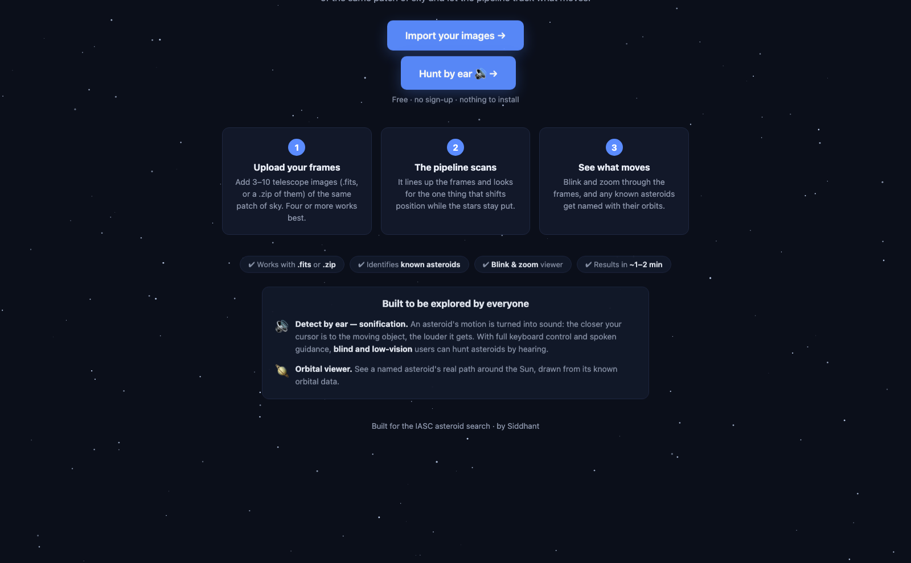
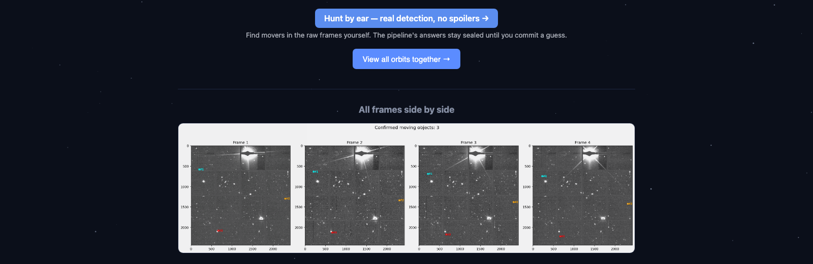
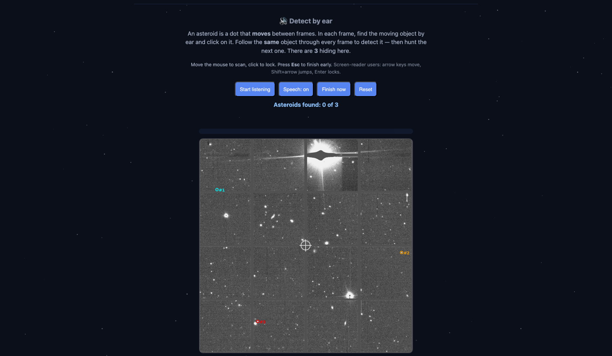
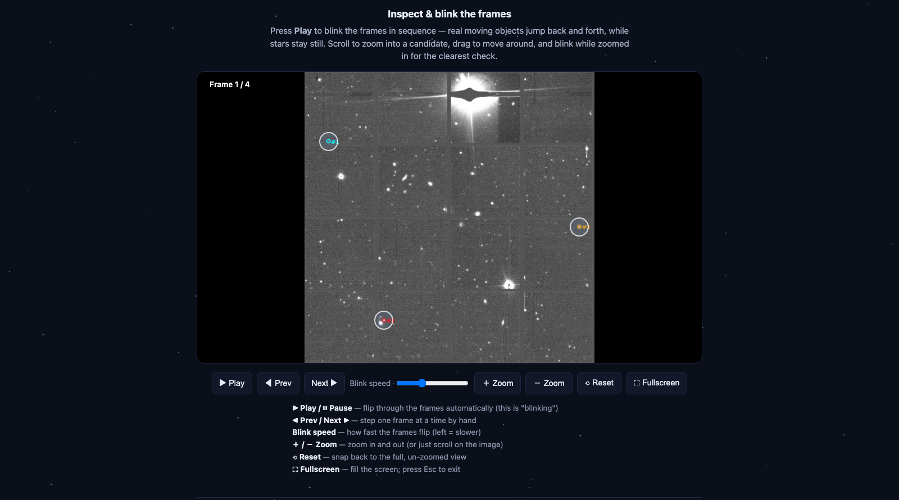
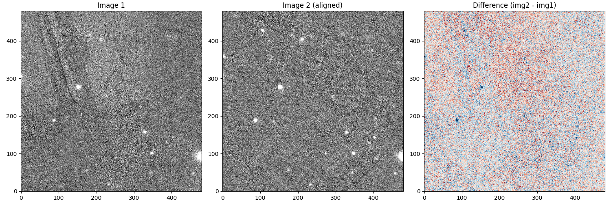
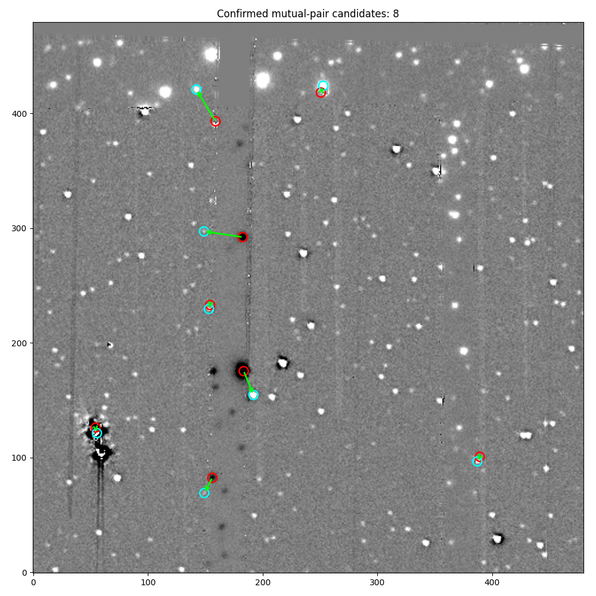

# asteroid-hunter

Finds moving asteroids in telescope images — two complementary ways.

Give it a set of images of the same patch of sky taken minutes apart, and it lines them up, finds every point of light, picks out the ones that move in a straight line (asteroids move, stars don't), throws out false alarms, and checks each one against a database of known asteroids.

On top of that, an interactive **"hunt by ear"** tool sonifies a shift-and-stack score so a user (potentially blind) can roam the image with a keyboard and hear where moving objects are — reaching asteroids too faint for single-frame detection.

## Results

Run on the IASC set203 practice dataset (4 frames, ~21 minutes apart), the tool confirms **4 of the 7 known asteroids** in the field — three via the automatic pipeline, and a fourth (V22.5, below the pipeline's single-frame limit) recovered by the shift-and-stack score with a velocity match to the catalog within 3° and 2%.

| Object       | Speed       | Brightness (V) | How detected |
|--------------|-------------|----------------|--------------|
| 2002 GE56    | 818 ″/day   | 19.16          | pipeline     |
| 2004 RH62    | 745 ″/day   | 19.90          | pipeline     |
| 2015 RM287   | 975 ″/day   | 21.75          | pipeline     |
| 2002 QK157   | 826 ″/day   | 22.5           | shift-and-stack (see below) |

Each pipeline match is within ~3.8 arcseconds of the official catalog position. The QK157 recovery is documented in detail in the *Faint recovery* section below, including the honest counter-example where the same method correctly rejects noise.

### The pipeline in action


*Current pipeline output on set203: cyan → red arrows mark the same object's motion across the 4 stacked frames. Three genuine movers are found; every star sits still in the difference image and is correctly ignored.*

### The web app



*Landing page: upload frames or hunt by ear.*



*Results page: confirmed movers marked across every frame.*



*Detect by ear: find moving objects using sound.*



*Blink viewer: flip frames to spot real movers.*

### How the detection method evolved

Three stages, each with an honest failure that pushed the next:



**Stage 1 — pure subtraction.** Line two frames up, subtract, whatever moved should light up. Reality: imperfect alignment leaves bright edge residuals around every star, and faint asteroids drown in that noise. Too many false positives to be useful.



**Stage 2 — segmentation + deblending.** Instead of subtracting pixels, find every point of light in each frame separately and split overlapping blobs (deblending). Cleaner detections, but no way to tell a faint real mover from noise. Still too many false positives.


**Stage 3 — track linking + validation.** Detect points in every frame independently, then keep only sets of points that fall on a straight line at consistent brightness across all 4 frames — asteroids move, stars don't. Cross-match survivors against SkyBoT. This is what the pipeline does today, and it produces the 3 confirmed detections above.

## How it works

*(keep your existing 5-step Align/Detect/Track/Filter/Cross-match section as-is)*

## Hunt by ear

An interactive web tool at `/hunt/<session>` that turns a live shift-and-stack score into pitch and pulse. You roam the image with arrow keys, adjust guessed velocity, and hear the sound tighten and rise as you approach a real moving object. Commits below the measured noise floor (score < 0.35) are refused; commits in the 0.35–0.45 range are flagged as low-confidence; above 0.45 are treated as candidates.

The 0.45 threshold is set at the score QK157 achieved (see below). The tool is the reason the fourth asteroid in the results table above is there.

## How to run it

```bash
git clone https://github.com/sid6767-nemo/asteroid-hunter.git
cd asteroid-hunter
python3 -m venv .venv
source .venv/bin/activate      # on Windows: .venv\Scripts\activate
pip install -r requirements.txt

# option A: run the detection pipeline on the included sample
python scripts/exp_set203_pipeline.py

# option B: launch the web app (upload your own FITS frames, or use the sample)
python web/app.py
# then open http://127.0.0.1:5000
```

The sample dataset (`data/set203/`) is included; pipeline results save to `outputs/`, web-app results to `web/static/results/`.

## Current limits

- 3 of 7 known asteroids in set203 are detected automatically by the single-frame pipeline; QK157 (V22.5) is recovered by the shift-and-stack score. The two faintest (V≈22.1 and 23.6) remain undetected by either method — genuinely near or below the stacking limit for this arc length.
- One catchable object (2007 DT63, V≈20.1) falls outside the binned frame in the current alignment — a to-do to loosen edge handling.
- Single-night 4-frame data cannot support orbit determination; this tool produces astrometry, not orbits (a real, honest limit — the standard Gauss method returns nonsense values on this arc, which is exactly what you'd expect from ~63 minutes of coverage).