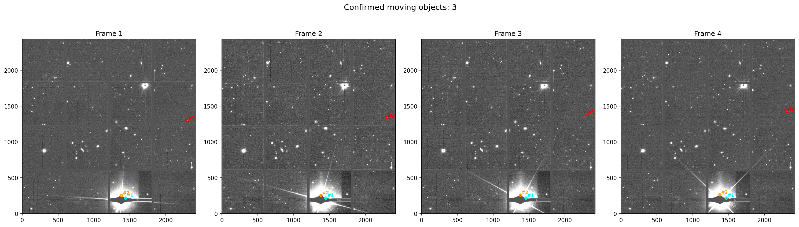

# asteroid-hunter

Finds moving asteroids in telescope images automatically — no clicking through frames by hand.

Give it a set of images of the same patch of sky taken minutes apart, and it lines them up, finds every point of light, picks out the ones that move in a straight line (asteroids move, stars don't), throws out false alarms, and checks each one against a database of known asteroids.

## Results

Run on the IASC **set203** practice dataset (4 frames, ~21 minutes apart), the pipeline confirmed **3 real named asteroids**, each matched to the official catalog within ~3.8 arcseconds:

| Object | Speed | Brightness (V) |
|--------|-------|----------------|
| 2015 RM287 | 975 ″/day | 21.75 |
| 2004 RH62 | 745 ″/day | 19.90 |
| 2002 GE56 | 818 ″/day | 19.16 |



## How it works

1. **Align** — line up the frames so the stars sit in the same place (using `astroalign`).
2. **Detect** — find every point of light in each frame (`photutils` segmentation + deblending).
3. **Track** — stars stay put, asteroids move. The pipeline looks for points that shift in a straight line across the frames.
4. **Filter** — throw out false alarms: junk near bright stars, and anything that isn't a clean straight-line mover with steady brightness across all 4 frames.
5. **Cross-match** — check each surviving candidate against the SkyBoT database to see if it's a known asteroid.

## How to run it

```bash
# clone the repo
git clone https://github.com/sid6767-nemo/asteroid-hunter.git
cd asteroid-hunter

# set up a virtual environment
python3 -m venv .venv
source .venv/bin/activate      # on Windows: .venv\Scripts\activate

# install dependencies
pip install -r requirements.txt

# run the pipeline on the included sample data
python scripts/exp_set203_pipeline.py
```

The sample dataset (`data/set203/`) is included, so it works straight out of the box. Results are saved to the `outputs/` folder.

## Known limitations

This is a work in progress. Right now:

- One artifact near a very bright star still slips through the filters occasionally.
- The two faintest known asteroids in the field (V≈22.5 and 23.6) are below the detection threshold — too dim to see in single frames without stacking.
- One catchable object (2007 DT63, V≈20.1) isn't being picked up yet — it's on the to-do list.

**Goal:** detect all 7 known asteroids in the set203 field cleanly and automatically, with no hardcoded positions.

## Data credit

The sample images come from the **International Astronomical Search Collaboration (IASC)** and the **Pan-STARRS** survey. They're used here for educational and practice purposes.
