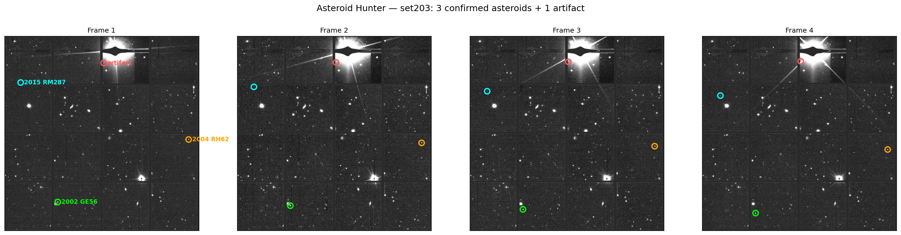

# Asteroid Hunter

A pipeline for detecting moving objects (asteroids, comets) in telescope survey images.

## Why I built this

I took part in IASC (International Astronomical Search Collaboration), where students manually scan telescope images looking for moving objects. Over 20 datasets I found two things — both were rejected. One was a comet (not what the campaign wanted), and one was a faint object the verification system couldn't lock onto because it was too faint to meet the "evenly spaced detections" rule.

That bothered me. The validation rules are tuned for bright, easy objects — but the most interesting undiscovered objects are faint ones near the detection limit. So I'm building a pipeline that detects candidates automatically, doesn't reject things by category, and is free and open-source so students don't have to pay to do this.

## What it does

Given a set of images of the same patch of sky taken minutes apart, the pipeline:

1. **Aligns** the frames onto the same pixel grid, using star positions as reference (`astroalign`).
2. **Detects** every point of light in each frame (`photutils` segmentation + deblending).
3. **Tracks** moving objects — stars stay put, asteroids shift in a straight line across the frames.
4. **Filters** out false alarms: junk near bright stars, and anything that isn't a clean, steady, straight-line mover.
5. **Cross-matches** each candidate against the SkyBoT database to identify known asteroids.

## Results

Run on the IASC **set203** dataset (4 frames, ~21 minutes apart), the pipeline confirmed **3 real named asteroids**, each matched to the official catalog within ~3.8 arcseconds:

| Object | Speed | Brightness (V) |
|--------|-------|----------------|
| 2015 RM287 | 975 ″/day | 21.75 |
| 2004 RH62 | 745 ″/day | 19.90 |
| 2002 GE56 | 818 ″/day | 19.16 |



## How to run it

```bash
git clone https://github.com/sid6767-nemo/asteroid-hunter.git
cd asteroid-hunter

python3 -m venv .venv
source .venv/bin/activate      # Windows: .venv\Scripts\activate

pip install -r requirements.txt
python scripts/exp_set203_pipeline.py
```

The sample dataset (`data/set203/`) is included, so it runs out of the box. Results are saved to `outputs/`.

## Known limitations

Still a work in progress:

- One artifact near a very bright star still slips through occasionally.
- The two faintest known asteroids in the field (V≈22.5 and 23.6) are below the detection threshold.
- One catchable object (2007 DT63, V≈20.1) isn't picked up yet.

## What's next

- Detect all 7 known asteroids in the set203 field cleanly and automatically, with no hardcoded positions.
- GPU acceleration for the detection and matching steps, to handle larger image sets faster.
- A simple web interface so anyone can upload frames and run the search in a browser.

## Data credit

The sample images come from **IASC** and the **Pan-STARRS** survey, used here for educational and practice purposes.
